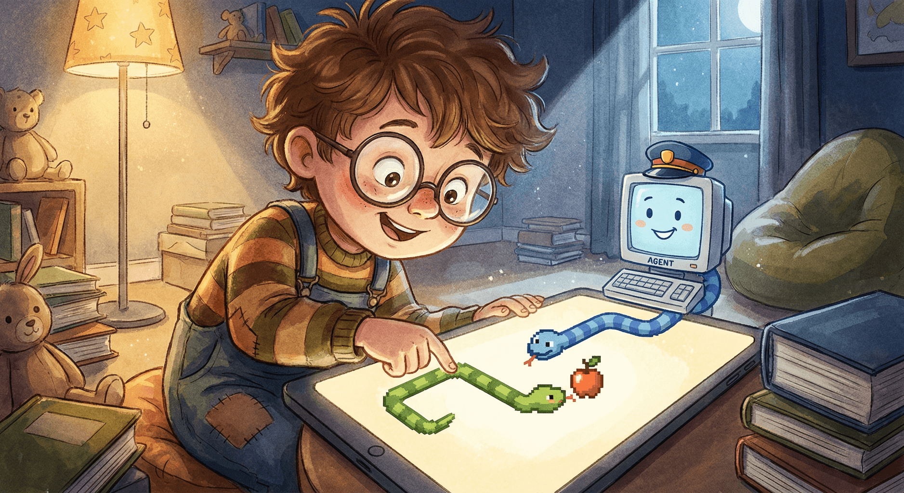

# Snake Duel

## Overview
Snake Duel is a minimalist, high-contrast Snake game with two competitors: a human-controlled snake and an autonomous agent racing for the same food. The game runs infinitely with instant respawns, speed scaling as scores climb, and a shareable score card.

## Features
- Two snakes (human vs agent) on one grid
- Single shared food target
- Instant respawn on death (score resets for the dead snake)
- Increasing speed as total score rises
- Distinct snake colors (human blue, agent red)
- Share button that generates a professional PNG score card
- Share card includes max scores and a snapshot of the current game

## Controls
- Move: Arrow keys or WASD
- Pause: Space
- Restart: Enter

## Run
Open `index.html` in a browser.

## Share Card
Click **Share** to generate a PNG card. A modal preview opens with a **Download PNG** action.

## Files
- `index.html`: UI markup and modal
- `style.css`: minimalist dark theme styles
- `main.js`: game logic, AI, rendering, and share card generation
